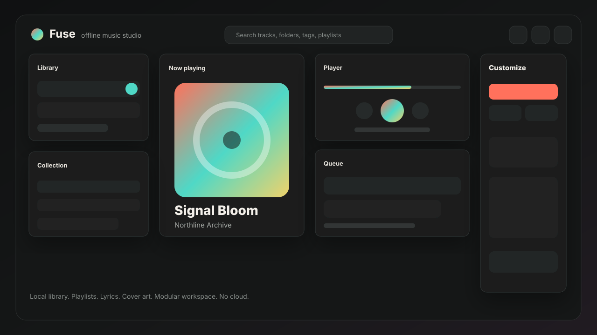

# Fuse

[](https://github.com/kristexIO/Fuse/actions/workflows/windows-build.yml)
[](https://github.com/kristexIO/Fuse/actions/workflows/release.yml)



Fuse is an offline-first desktop music app for Windows. It is built for people who want a local Spotify-like library without accounts, cloud sync, telemetry, or network dependency.

The current product direction is **Clean Studio + Swarm Beta**: a modular workspace, soft motion, draggable/resizable panels, strong cover-focused visuals, local discovery, and a Rust backend that owns the music library and optional private P2P sharing.

Current release target: **1.1.0-beta.1**.

## Highlights

- Import individual MP3 files or whole music folders.
- Scan local metadata with `lofty`: title, artist, album, duration, format, file size, modified time, embedded lyrics, and embedded cover art.
- Play imported local tracks through the Rust audio engine with WebView fallback.
- Build local playlists, add/remove/reorder tracks, rename playlists, and launch an active playlist.
- Edit track details locally: title, artist, album, lyrics.
- Add or replace local cover art without modifying the source audio file.
- Search tracks and browse artists, albums, folders, playlists, missing-tag files, and library stats.
- Use the Discover block for local smart playlists, fuzzy search, offline recommendations, duplicate checks, broken-file repair, and local radio.
- Customize the workspace: themes, density, panel order, visibility, presets, drag/drop, and resize.
- Save custom layout presets and export/import Fuse workspace settings without an account.
- Share explicitly selected tracks or playlists with private `fuse-share:v1:` tickets through optional Swarm P2P.
- Pause, resume, cancel, retry, and inspect Swarm transfers with peer counts, progress, speed, and ETA.
- Use presentation-ready presets for studio, library, minimal, showcase, and playlist-focused layouts.
- Persist library, playlists, artwork, lyrics, layout profiles, and the current queue locally.
- Keep managed library folders, scan history, diagnostics, and app settings local to the device.
- Use the browser preview as a polished demo surface with mock data; real file import remains desktop-only.

## Stack

- Tauri 2
- Rust
- SQLite via `rusqlite`
- Audio metadata via `lofty`
- React
- TypeScript
- Vite

## Privacy Model

Fuse is local by design.

- No login.
- No cloud library.
- No telemetry.
- No remote sync.
- No external metadata lookup in the current build.
- Swarm is disabled by default and only shares tracks/playlists selected by the user.
- Swarm Beta is accountless and pseudonymous, but it is not Tor-level IP anonymity.

## Development

Install dependencies:

```powershell
npm install
```

Run the web preview:

```powershell
npm run dev
```

Run the desktop app:

```powershell
npm run tauri dev
```

Run checks:

```powershell
npm run quality
```

Build Windows installers:

```powershell
npm run tauri build
```

Build artifacts are written to:

- `src-tauri/target/release/bundle/nsis/`
- `src-tauri/target/release/bundle/msi/`

Production releases are built by GitHub Actions from version tags such as `v1.1.0-beta.1`.

## Current Status

Fuse is in **Swarm Beta**. The desktop app supports import, metadata indexing, playlists, editable lyrics/details, cover art, workspace customization, local Discover, persisted queue state, Rust-backed playback, WebView playback fallback, and optional private ticket-based P2P sharing.

The browser preview intentionally uses mock data and disables desktop-only import actions so it can be shown without implying real filesystem access.

## Roadmap

- Dedicated Rust/WASAPI output controls and device selection.
- File watcher for automatic library updates.
- Cover-art extraction cache on disk for very large libraries.
- Tag writing back to audio files as an explicit opt-in operation.
- EQ/audio output controls.
- Strong anonymity transport mode for Swarm beyond pseudonymous node identity.
- Release signing and auto-update channel.

## License

MIT
